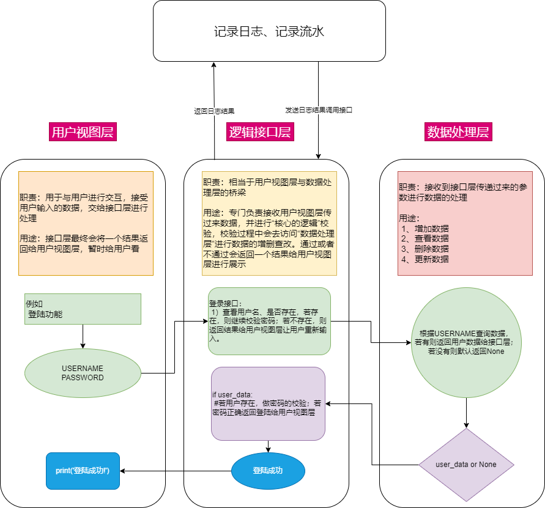

# 项目的说明书

## 项目名称 : ATM + 购物商城程序

# 项目需求

    1. 额度 15000或自定义  ---> 注册功能（自定义额度）
    2. 实现购物商城，买东西加入 购物车，调用信用卡接口结账  ---> 购物功能 / 支付功能
    3. 可以提现，手续费5%  ---> 提现功能
    4. 支持多账户登录  ---> 登录功能
    5. 支持账户间转账  ---> 转账功能
    6. 记录日常消费流水 ---> 记录流水功能
    7. 提供还款接口  ----> 还款功能
    8. ATM记录操作日志   ---> 记录日志功能
    9. 提供管理接口，包括添加账户、用户额度，冻结账户等。。。  ---> 管理员功能
    10. 用户认证用装饰器 ---> 登录装饰器功能
    11. 每月22号出账单，每月10号为还款日，过期未还，按欠款总额 万分之5 每日计息

## 用户视图层展示给用户选择的功能

    1、注册功能
    2、登录功能
    3、激活银行卡
    4、查看余额
    5、提现功能
    6、存款功能
    7、转账功能
    8、查看流水
    9、购物功能
    10、查看购物车
    11、管理员功能
    退出系统请按q

# 一个项目是如何从无到有的

## 一 需求分析

    1.拿到项目，会先到客户那里一起讨论需求，商量项目的功能是否能实现，周期与价格，得到一个需求文档。
    
    2.最后在公司内部需要开一次会议，最终得到一个开发文档
    交给不同岗位的程序员进行开发
        - Python : 后端 / 爬虫
        - 不同的岗位 : 
            - UI 界面设计 : 
            
            - 前端 :
                - 拿到UI交给他的图片,搭建网页
                - 设计一些页面中,哪些位置需要接收数据,需要进行数据交互
    
            - 后端 : 
                - 直接核心的业务逻辑，调整数据库进行数据库的增删改查
    
            - 测试 : 
                - 会给代码进行全面测试
                    - 比如压力测试、界面测试(CF卡箱子)
    
            - 运维 : 
                - 搭建项目架构
                - 部署项目

## 二 程序的架构设计

### 1、程序设计的好处

    1） 思路清晰
    2） 不会出现写一般代码时推翻重写
    3） 方便自己或同时进行代码维护

### 2、架构图设计



### 3、三层架构的好处

```
1） 把每个功能都分层三部分，逻辑清晰
2） 如果用户更换不用的用户界面或不同的数据储存机制都不会影响接口层的核心逻辑代码，扩展性强
3） 可以在接口层，准确的记录日志和流水
```

#### 一 用户视图层

```
用于与用户交互，可以接收用户的输入，打印接口返回的数据。
```

#### 二 逻辑接口层

```
接受用户层传过来的参数，根据逻辑判断调用数据层加以处理
并返回一个结果给用户视图层
```

#### 三 数据处理层

```
接收接口层传递过来的参数，做数据处理
    - 保存数据 save()
    - 查看数据 select()
    - 更新数据
    - 删除数据
```
